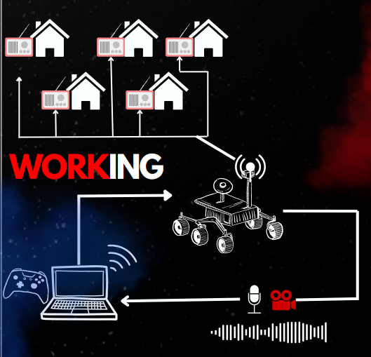
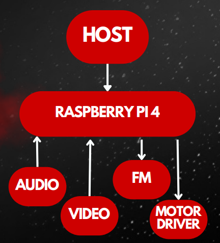

# RadioRover

Meet RadioRover, a unique robot designed to bring FM Channels to remote locations. With its wireless control system, you can effortlessly maneuver the robot from a laptop connected to the same network. Equipped with a camera and microphone, RadioRover provides real-time feedback, letting you monitor its path and ensure a
smooth journey through any terrain. We can deploy this mobile FM station to remote and marginalized areas, and
instantly establish a reliable broadcast, spreading joy, music, news, and entertainment to those who have limited
access.


)

### Working: 

The Robot will be controlled by our Laptop through socket programming. The robot will be equipped with a camera and microphone. The camera will be used to stream the video to the laptop. The microphone will be used to stream the audio to the laptop. The laptop will be connected to the internet. The laptop will be connected to the robot through a local network. The Robot can transmit fm signals ie, we can create a remote FM channel. We can send a audio file through our laptop and start FM broadcast. The robot has a backtracking system with which it can relocate its starting point and come back automatically



### Components: 

1. Raspberry Pi 3B+
2. Arduino Uno
3. L298N Motor Driver
4. 12V Battery
6. Webcam/ Camera
7. Microphone
8. 4 DC Motors
9. 4 Wheels
10. Servo Motor
11. Laptop




## Installation: 


Load all the files in the Server folder to the Raspberry Pi. Make sure to install python3 and pip3. Install all the dependencies using the command ```pip3 install -dependency```. Run the server file using the command ```python3 ___server.py```. The server will be running on some defined port feel free to change the port number. Make sure to change the ip address in both server and client files. Load the client files to the laptop. Install all the dependencies using the command ```pip3 install -dependency```. Run the client file using the command ```python3 ___client.py```. The client will be running on some defined port feel free to change the port number. Make sure to change the ip address in both server and client files.
You have multiple server and client files namely:   
1. ```motor_server.py``` and ```motor_client.py```: This is the basic server and client file. This is used to control the robot using the keyboard.
2. ```video_server.py``` and ```video_client.py```: This is an important server and client file. This is used to monitor the robot movements and location using camera and microphone in the robot from the laptop.
3. ```FM_server.py``` and ```FM_client.py```: This server and client files are used to control the FM broadcast.


## Output:


Contact us for any further details
rajendrakumarvesapog@gmail.com

